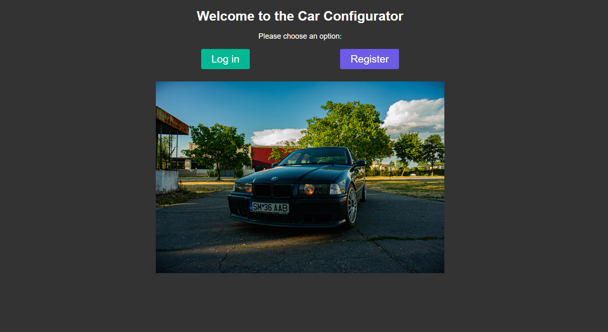
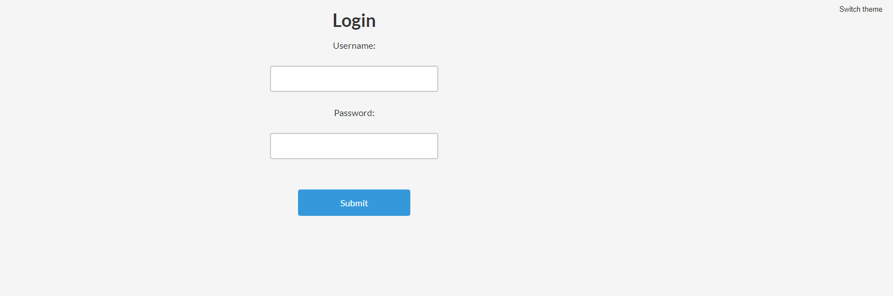
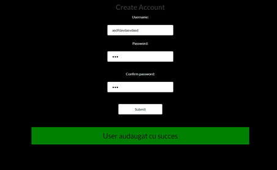

# Car-Configurator-App

Car configurator app done for the final project for the OOP course at university.

## About

The purpose of the project was to display what we have learned during the semester in the OOP course.

### Technologies

<ul>
    <li>Back-End: Spring-Boot:leaves:</li>
    <li>Front-End: HTML and CSS:paintbrush:</li>
    <li>DBMS: MySQL:books:</li>
    <li>Webserver: Apache:globe_with_meridians:</li>
</ul>

### Usage

The user when entering on [**index.html**](Front%20End/index.html) can register a new account or log in if he already has one.

[**login.html**](Front%20End/login.html) Simple Log In page with white/dark theme

[**register.html**](Front%20End/register.html) Simple Register page with white/dark theme and common fields

## Back-End

It has a simple `Controller -> Service -> DataAccess` layered structure. Every API call except **/login** requires a JWT authentication token
