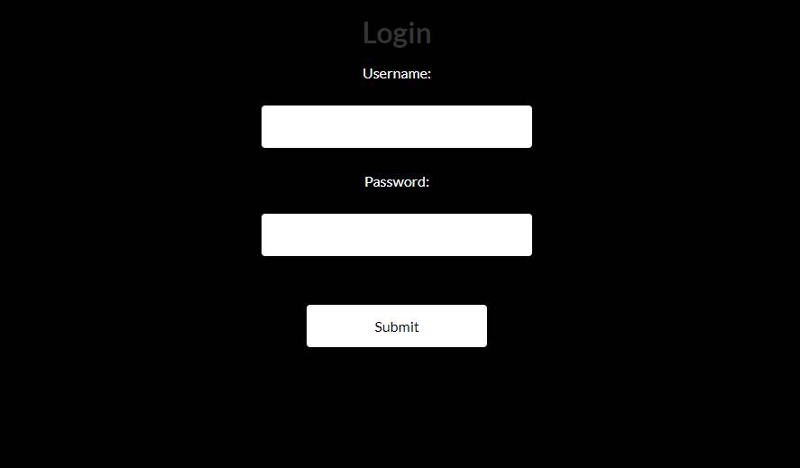

# Car-Configurator-App

Car configurator app done for the final project for the OOP course at university.

## About

The purpose of the project was to display what we have learned during the semester in the OOP course.

### Technologies

<ul>
    <li>Back-End: Spring-Boot:leaves:</li>
    <li>Front-End: Javascript, HTML and CSS:paintbrush:</li>
    <li>DBMS: MySQL:books:</li>
    <li>Webserver: Apache:globe_with_meridians:</li>
</ul>

### Usage

The user when entering on [**index**](Front%20end/index.html) can register a new account or log in if he already has one.

[**login**](Front%20end/login.html) Simple Log In page with white/dark theme

[**register**](Front%20end/register.html) Simple Register page with white/dark theme and common fields

After successfully loging in the user arrives on his home page [**home**](Front%20end/configureCar.html)

Here the user has 4 drop-down menus. He can choose an engine, a set of rims and a paint for the car. After he chooses something the disaplyed car below will be updated acordingly. Also a small description table will appear on the left with details about the selected option.

 
If he chooses an already configured car stored on his account all the options will be imported.
 
The price is also displayed on the top right of the screen

## Back-End

It has a simple `Controller -> Service -> DataAccess` layered structure.
 
Every API call except **/login** requires a JWT authentication token
